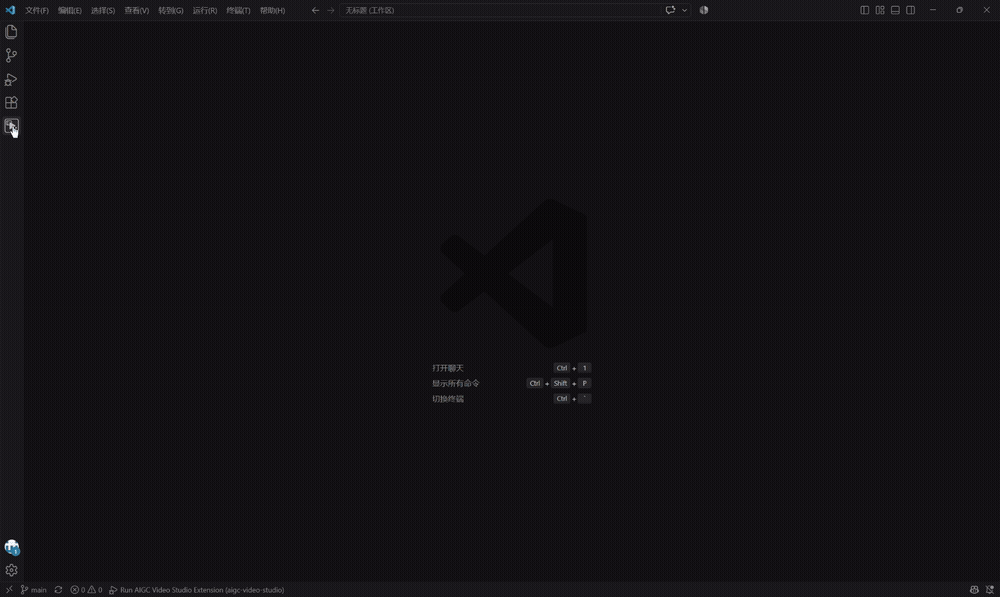

# AIGC Video Studio（AIGC 视频工作室）

在 VS Code 里完成一部 AI 短视频的全流程：从一句灵感、一组图片或一部小说出发，依次生成**创意、剧本、分镜脚本**，准备**角色、场景、道具等资产**，再把分镜提交给视频模型生成视频，并管理每次生成的结果。

文字内容（创意、剧本、分镜、资产提示词）默认由 **GitHub Copilot** 生成，也可以改用 **千问AI平台** 的文本模型；图片、音频和视频由 **千问AI平台** 的模型生成。每一步的产出都先进入“待确认”，由你检查、修改后再确认采用，确认后才会被下一步使用。

## 界面预览

## 功能一览

| 功能 | 说明 |
|---|---|
| 项目与作品 | 用项目组织作品；作品可以是单个短视频，也可以是多集短片 |
| 三种创作起点 | 文字灵感、图片灵感（最多 10 张）、小说改编（TXT / Markdown，长篇会自动分段处理） |
| 创意 → 剧本 → 分镜 | 逐步生成并人工确认；上游改动后，下游会提示“上游已变更” |
| 剧本拆解 | 剧本确认时自动抽取“集”和“实体”（角色、场景、道具、特效） |
| 分镜脚本 | 生成镜头、台词、旁白、音效、配乐；可新增、删除、调整镜头顺序，并按目标视频模型的画幅与时长生成 |
| 资产库 | 角色、场景、道具、特效、音频五类资产，所有项目共用；每个资产可以直接上传图片、音频，也可以让文本模型（Copilot 或千问文本模型）写提示词、再用图像或音频模型生成多个版本并选定其一；上传与生成两种来源的文件都保留，可随时切换使用哪一种 |
| 实体绑定 | 把剧本中的角色、场景等与资产库中的资产关联，作为视频的参考素材；可按名称自动匹配，也可由实体直接新建资产 |
| 视频生成工作台 | 按镜头组提交生成、查看队列、重试失败任务、播放结果、对比并采用不同版本、导出视频 |
| 镜头连贯 | 下一组可以用上一组视频的最后一帧作为首帧，也可以指定资产库里的一张图片作首帧，让镜头衔接自然 |
| 生成参数 | 模型、画幅、分辨率、声音模式与内容、随机种子、本组生成时长、负向清单、提示词改写，可按“作品 → 集 → 镜头组”逐级覆盖 |
| 数据备份 | 把全部数据备份到文件（资产的图片、音频随备份文件保存在旁边的同名文件夹），或从备份文件恢复 |
| 使用手册 Skill | 从侧栏“设置”卡片下载 ZIP 格式的用户使用手册 |

## 使用前准备

1. **VS Code 1.108 或更高版本。**
2. **文本模型**：默认使用 **GitHub Copilot**，需要安装 GitHub Copilot 扩展并登录；也可以在“设置 › 模型”的千问AI平台设置中启用文本模型（需要配置千问访问密钥）。两者可以同时启用，在“默认文本模型”中选择，也可以为单个作品单独选择。每次生成创意、剧本、分镜脚本和资产提示词前，表单里都有“文本模型”下拉，可以手动切换本次使用的模型。这些内容都用所选模型生成；没有可用的文本模型时这些功能无法使用。
3. **千问AI平台的访问密钥**：生成图片、音频和视频需要。在侧栏“设置 › 模型”中配置，见下文“配置模型”。
4. 图片灵感和小说改编还需要准备素材文件：图片（PNG、JPEG、WebP，每张不超过 10 MB）或小说文本（TXT / Markdown，UTF-8 编码，不超过 5 MB）。

## 安装

- 从 VS Code 扩展市场搜索 “AIGC Video Studio” 安装；或
- 使用安装包：在扩展视图右上角的“…”菜单中选择“从 VSIX 安装…”，选择 `.vsix` 文件。

安装后，活动栏会出现 **AIGC Video Studio** 图标，点击打开侧栏。

## 快速开始

1. 侧栏“设置 › 模型”：启用“千问AI平台”，填入访问密钥并点“测试连接”。
2. 侧栏“项目 › 所有项目”右侧点“创建”，新建一个项目。
3. 侧栏“创作”下，在“文字灵感”右侧点“添加”，输入灵感，点“创建并生成”。
4. 在弹出的产出层检查创意，点“确认采用”。
5. 侧栏“脚本 › 剧本”右侧点“添加”，选择作品，生成并确认剧本。
6. 侧栏“脚本 › 分镜”右侧点“添加”，选择作品，设置目标视频模型、画幅等，生成并确认分镜脚本。
7. 侧栏“资产”下为角色、场景等准备资产，回到工作台完成绑定。
8. 侧栏“视频 › 生成工作台”，选择集，提交镜头组，等待生成并采用满意的结果。

## 详细使用方法

### 侧栏

侧栏按制作顺序分为六个区。每行左侧是主入口（打开该类内容的列表），右侧是“创建 / 添加”按钮（直接新建）。

| 分区 | 入口 |
|---|---|
| 项目 | 所有项目（创建） |
| 创作 | 文字灵感、图片灵感、小说改编（添加） |
| 脚本 | 剧本、分镜（添加） |
| 资产 | 角色、场景、道具、特效、音频（添加） |
| 视频 | 生成工作台 |
| 设置 | 模型、数据备份、下载用户使用手册 Skill |

点击“设置”卡片底部的“下载用户使用手册 Skill”按钮，选择保存位置即可下载 ZIP 文件。

### 1. 配置模型

打开“设置 › 模型”：

- **文本生成**：“启用 Copilot 文本模型”开关决定 Copilot 的模型是否出现在选择列表中；“默认文本模型”从 Copilot（自动或某个模型）和已启用的千问文本模型中选择，作品没有单独选择时使用，资产提示词也使用它。已关闭或停用的模型不会出现在列表中。小说的分段方式（按章节或按字数）和每段字数上限是公共设置，对所有文本模型都适用。这些设置也可以在 VS Code 设置中搜索 “AIGC Video Studio” 修改。
- **服务商**：点“千问AI平台”的“设置”，开启“启用”，填入访问密钥并保存（密钥保存在 VS Code 的安全存储中，不会写入数据库或备份文件）。接口地址保持默认即可；如需修改，须以 `https://` 开头、`/api/v1` 结尾。点“测试连接”可检查地址和密钥是否可用。
- **模型**：服务商下列出可用的文本、图像、音频、视频模型，可单独启用或停用，并显示各自支持的画幅、分辨率、时长等能力。只有“模型已启用、服务商已启用且已配置密钥”时，才能在其他页面选择该模型。千问文本模型默认不启用，需要时在服务商设置里单独启用。
- **文本模型不可用时**：生成前会按“作品单独选择的模型 → 默认文本模型 → Copilot 自动（仅在检测到可用的 Copilot 模型时） → 第一个已启用的千问文本模型”依次选用可用的一个，没有检测到可用的 Copilot 模型时，选择列表里不显示“Copilot · 自动”。作品原来选择的模型已不可用时，新建、编辑、重新生成作品的表单会提示“原选择的文本模型已不可用，当前将使用……”。如果你指定的是某个 Copilot 模型，而它当前不可用，生成会报错并提示到“模型设置”更换文本模型，不会自动换成别的模型。

当前可用的千问AI平台模型：

| 类型 | 模型 |
|---|---|
| 文本 | Qwen3.8 Max、Qwen3.8 Flash、Qwen3.7 Plus、Qwen3.7 Flash、Qwen3.6 Plus、Qwen3.6 Flash（默认不启用） |
| 视频 | 万相 3.0 视频、万相 3.0 视频（高速版） |
| 图像 | 千问图像 3.0、千问图像 3.0 Pro、万相 2.7 图像、万相 2.7 图像 Pro |
| 音频 | 千问音频 3.1（语音与音效）、Fun-Music 音乐生成（需在平台申请开通） |

### 2. 项目

- “所有项目”列出全部项目，可搜索、编辑、删除。
- 项目可设置名称、描述、视觉风格、默认画幅和默认分辨率；视觉风格会作为之后生成内容的默认风格，修改它不会改动已生成的内容。
- 删除项目会同时删除其中的作品和视频结果，需输入项目名称确认；资产不属于项目，不受影响。

### 3. 创作：生成创意

在“创作”下选择素材来源，点“添加”新建作品：

| 来源 | 需要提供 |
|---|---|
| 文字灵感 | 一段创作主题或灵感 |
| 图片灵感 | 1 至 10 张图片，可调整顺序 |
| 小说改编 | 小说文件；可写明“必须保留”和“允许调整”的内容 |

共同选项：所属项目、作品名称、作品形态（单个短视频 / 多集短片）、文本模型（默认沿用“模型设置”中的默认文本模型，也可为这个作品单独选择）、题材、基调、每章大约字数范围、章节数上限、补充要求。

点“创建并生成”后，所选文本模型在后台生成创意章节，页面里的产出层会显示进度。生成完成后：

- 可直接编辑章节内容；
- 点“确认采用”后，才能进入剧本阶段；
- 不满意可点“重新生成”；生成中可取消，失败可重试；重试时如果素材（如图片、小说文件）或分段设置与上次不一致，会提示并丢弃之前的进度和章节，从头开始。

主入口打开的作品列表可以查看、修改、删除作品。修改作品时，图片灵感可以增删图片，但不会自动重新生成，需要点“重新生成”才会采用新图片。

### 4. 脚本：剧本

在“脚本 › 剧本”点“添加”，选择创意已确认的作品，设置单集最大时长、集数上限（多集短片）和补充要求，开始生成。

- 剧本生成后会同时抽取“集”和“实体”（角色、场景、道具、特效）；
- 可编辑剧本正文、集和实体，也可调整集的顺序；正文改动后，点“重新抽取”可按新正文重新抽取集和实体；
- 点“确认采用”后，集和实体才会正式建立；新版本里已经不存在的旧集，如果没有分镜脚本、资产绑定和生成参数，确认时会被移除；如果已有这些数据，确认会被拒绝，需要先在新版本里保留这些集。确认前的提示会分别列出这两类集；
- 剧本被重新确认时，会列出已有分镜脚本的集，方便你判断影响。

### 5. 脚本：分镜

在“脚本 › 分镜”点“添加”，选择剧本已确认的作品（多集短片可一次选择多集，各集并行生成）。

主要选项：

| 选项 | 说明 |
|---|---|
| 目标视频模型、画幅、分辨率 | 选择后会保存为作品的默认生成参数，工作台沿用；选项受模型能力限制 |
| 画面风格 | 留空沿用项目视觉风格 |
| 单镜头时长范围、镜头总数上限 | 控制镜头的节奏与数量 |
| 单组最长时长 | 相邻镜头会按顺序打包成“镜头组”，一组生成一个视频；该值应不超过所选模型单次生成的最长时长 |
| 连贯策略 | 无 / 尾帧接首帧 / 由 AI 判断 |
| 声音模式与内容 | 无声或由模型原生生成；可选对白、旁白、音效、背景音乐 |

较长的剧本会按场次分批生成；剧本正文里以“第N场”开头的场次标题越规范，分批越准确。

生成后可在产出层编辑镜头、台词和声音，新增、删除镜头，调整镜头顺序，然后“确认采用”。景别、机位与视角、摄影机运动、转场和声音会在生成视频时按千问官方提示词公式自动合并进提示词，所以“中文提示词”只需描述主体、场景和动作。剧本被修改后，分镜会显示“上游已变更”。

### 6. 资产

资产分为角色、场景、道具、特效、音频，**所有项目共用**，名称在同类型内唯一。

- **新建**：点“添加”后先选择“上传”还是“AI 生成”。选上传：直接上传文件，图像类上传 1 至 10 张参考图，音频类上传 1 个音频文件（不超过 60 秒）并选择音频类型，这样的资产没有提示词和生成入口。选 AI 生成：填写名称、视角与构图、风格、背景和各类型的特有描述，保存时可选“创建并生成提示词”，文本模型会在后台写出中英文提示词。
- **切换来源**：每个资产使用上传的文件或生成采用的版本，列表“使用的文件”列里点“改用上传 / 改用生成”随时切换，两种来源的文件都会保留（还没有上传过文件时，“改用上传”会打开上传表单）。绑定和视频生成使用的是当前来源的文件。
- **分类**：每种资产类型有自己的分类（例如角色分类、场景分类）。列表顶部的下拉默认显示“全部”，也可以只看某个分类或“未分类”；点“分类管理”可创建、修改、删除分类，删除分类不会删除资产，这些资产会变为“未分类”。新建和修改资产时可在“所属分类”里选择分类，默认“不分类”。
- **提示词**：可随时查看、手动修改或重新生成。
- **生成**：用“生成图片”或“生成音频”选择模型、语言、数量等，提交后在“版本”里查看。每次生成都会产生新版本并全部保留，选择其中一个“采用”作为最终结果。每次提交按平台规则计费。
- **音色参考**：角色可绑定一个音频资产作为音色参考，可在绑定页直接试听。被角色用作音色参考的音频不能改用没有文件的来源，需先解除绑定或准备好文件。

### 7. 视频生成工作台

从侧栏“视频 › 生成工作台”进入（生成完成的右下角通知上也有“打开工作台”按钮）。选择项目、作品和分集后，页面分为：

- **左栏**：本集的镜头组，显示状态（待绑定、可生成、等待前序、排队中、生成中、已完成、失败、已取消）；
- **中栏**：选中镜头组的详情（镜头、出场实体、生成状态），可在某个镜头前拆开镜头组、并入上一组或按新的单组时长重新分组（重新分组会清除各组已有的生成记录，已保存的视频文件不会删除），也可编辑镜头；
- **右栏步骤**：“绑定素材”“配置参数”“检查并提交”三个步骤，页签上显示每步的状态（如“6 项未绑定”）；
- **底部**：可折叠的“队列与结果”。

**绑定**：为每个实体选择资产，一个实体可绑定多个资产并指定主资产；“按名称自动匹配”会先列出将建立的绑定，确认后才写入；每个实体也可以按设定直接新建资产。有实体未绑定资产时，对应镜头组显示“待绑定”。

**参数**：可在“作品默认 / 本集 / 本镜头组”三个范围设置，每项会标明来源（继承自作品、本集覆盖等），清空即恢复继承。

| 参数 | 说明 |
|---|---|
| 视频模型、画幅、分辨率 | 受模型能力限制 |
| 声音模式、声音内容 | 无声或模型原生生成；可选对白、旁白、音效、配乐；模型不支持的类型会置灰 |
| 随机种子 | 留空表示随机；模型不支持时置灰 |
| 负向清单 | 写在提示词末尾、告诉模型“不要什么”，如“不要字幕，不要水印”（默认值）；只写不希望出现的内容，不必凑数；常用项可一键加入，清空表示不要负向清单 |
| 提示词改写 | 是否让平台改写提示词；默认沿用平台的开启，关闭后严格按编排好的提示词生成；模型不支持时置灰 |
| 本组生成时长 | 仅镜头组范围；留空按镜头总时长向上取整，指定值不得小于镜头总时长，且须在模型支持的范围内 |

**提交**：“检查并提交”步骤会预览将要提交的镜头组、实际使用的参数、参考图数量，以及阻断提交的问题和提醒（例如实体未绑定、超出模型范围、模型不支持的声音内容）。没有阻断问题时可提交所选镜头组或全部镜头组；提交失败或所选镜头组全部被拒绝时，已勾选的镜头组会保留，修正后可直接再次提交。生成通常需要一到几分钟，完成或失败时右下角会有通知。

**队列与结果**：

- 可取消排队或生成中的任务、重试失败的任务（会显示失败原因与处理建议）；同一镜头组正在生成时不能再次提交，完成或取消后才能再次提交；
- 点击结果可内置播放，还可以打开、导出视频，或在文件夹中显示；
- 同一镜头组每次提交都会保留一个结果版本，第一个成功的结果自动采用；有两个以上成功版本时，可以进入“结果版本”页采用其他版本，并对比参数和提示词的差异，版本页列出这一组全部历史成功的版本。

**镜头连贯**：如果某组的第一个镜头设为“上一镜头尾帧作首帧”，这一组会等上一组生成完成，用上一组视频的最后一帧作为首帧再提交。注意：

- 截取尾帧需要工作台页面保持打开；页面关闭期间，这一组会停在“等待前序”，重新打开后继续；
- 使用尾帧作首帧时，这一组不再传实体的参考图和音色参考；
- 上一组如果重新生成并改用了新版本，接在旧尾帧之后的这一组会提示“可能不连贯，建议重新生成”，不会自动重做；
- 前一组失败或被取消时，等待它的任务也会失败，需要在前一组成功后重新提交。

**指定图片作首帧**：在分镜脚本的“编辑镜头”里，把镜头组第一个镜头的“首帧来源”设为“指定图片”，再在“首帧图片”里选一个资产（角色、场景、道具、特效均可，需要至少有一张参考图），提交时用该资产的第一张参考图作首帧。注意：

- 只在镜头组的第一个镜头上生效；
- 这一组不依赖上一组，可直接提交；与尾帧作首帧一样，不再传实体的参考图和音色参考；
- 所选资产被删除或没有参考图后，这一组无法提交，需要重新选择或把首帧来源改为“不指定”；
- 所选模型必须支持首帧输入。

### 8. 数据备份

“设置 › 数据备份”可以：

- 查看数据库位置、大小、版本和各类数据数量；
- **备份到文件**：把全部项目、作品、剧本、分镜、资产、参数等数据保存为一个备份文件，同时把资产的图片、音频复制到备份文件旁的文件夹，使用过程中也可以备份；
- **从文件恢复**：选择备份文件，页面校验后需要你确认；确认后重新加载窗口生效，生效前会先自动备份当前数据。版本高于当前扩展的备份无法恢复。

**资产的图片和音频**：备份时会把数据库引用的资产文件复制到备份文件旁的同名文件夹（备份文件名加 `.files`，如 `xxx.sqlite.files`），**备份文件和这个文件夹要放在一起**。恢复时选择备份文件，页面会检查文件是否齐全，并从该文件夹补回缺少的文件（只补充，不覆盖也不删除现有文件）；找不到的文件会提示，恢复后对应的图片和音频无法显示。

注意：备份**不包含**已下载到本地的结果视频文件，也不包含访问密钥。如需保留视频，请自行复制页面中显示的结果视频目录。

**数据库无法打开时**：侧栏只显示“数据库无法打开：原因”和“数据备份（恢复）”一个入口，其他功能暂时不可用。打开“数据备份（恢复）”，页面只有“恢复”：选择之前备份的文件并确认，重新加载窗口后生效；无法打开的数据库文件会先被自动备份，再被替换。此时不能新建备份。

## 费用与限制

- 使用千问文本模型生成文字，以及生成图片、音频、视频，都由千问AI平台计费，每次提交都会产生费用，请以平台的计费规则为准；
- 取消任务时，如果平台不提供取消接口，只是停止本地跟踪，平台上的任务可能继续运行并计费，界面会给出提示；如果通知平台取消失败，界面会提示“通知平台取消失败”及原因，本地仍会取消，平台上的任务可能仍在继续并计费，请到平台控制台确认；
- 单个结果视频不超过 200 MB，超过时无法保存或在工作台里读取，请缩短时长或降低分辨率后重新生成；如果只是想用它的最后一帧衔接下一组，也可以把下一组的首帧来源改为“无”或“指定图片”；
- 单组视频的最长时长、可选画幅与分辨率取决于所选模型；
- 目前只接入千问AI平台的模型；
- 模型专有参数暂未开放。

## 常见问题

**点“生成”后提示没有可用的模型。**
到“设置 › 模型”检查：服务商是否启用、是否已填访问密钥、对应类型的模型是否启用。

**创意、剧本等文字内容无法生成。**
确认已安装并登录 GitHub Copilot，或在“设置 › 模型”启用了一个千问文本模型并填写访问密钥；两者可以同时启用。在“设置 › 模型”的文本生成设置里可以看到当前可选的文本模型。如果指定的 Copilot 模型当前不可用，请到“设置 › 模型”更换文本模型。

**视频一直停在“等待前序”。**
这一组在等待上一组的尾帧。请确认上一组已成功生成，并保持工作台页面打开；上一组失败或被取消时，需要先重新生成上一组。

**视频生成失败。**
工作台会显示失败分类、平台原文和处理建议。内容审核未通过时，请修改镜头描述并重新确认分镜脚本后再生成；鉴权类错误请检查访问密钥。

**数据库无法打开怎么办。**
侧栏会显示“数据库无法打开：原因”和“数据备份（恢复）”入口。打开它，选择之前备份的文件恢复，确认后重新加载窗口即可；恢复前无法打开的数据库文件会被自动备份（文件名带时间戳，目录显示在备份页上）。

**恢复备份后看不到某些视频。**
备份不含视频文件。备份之后新生成或删除的视频，与恢复的数据可能对不上。

**恢复备份后资产的图片或音频显示不出来。**
备份文件旁应有同名加 `.files` 的文件夹（如 `xxx.sqlite.files`），请把它和备份文件放在一起再恢复；选择备份文件时，确认对话框会提示有多少资产文件找不到。

## 许可证

Apache-2.0，详见 [LICENSE](LICENSE)。
